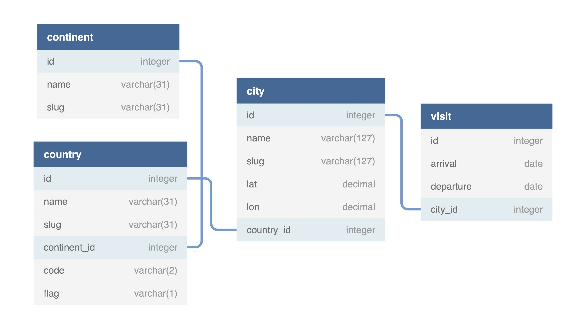

# TravelMap — track your travel history

[](https://github.com/tsaplev/travelmap/actions)

> App for tracking visited cities and flights


## Features

- View visited cities on map
- View flight paths on map
- View list of travels sorted by countries and years
- Switch between Cities Map and Flights Map
- Keep all your data self-hosted

## Getting Started

### Fill database with personal travels

> **NOTE**: _You are required to have basic understanding of relational databases._

Use any software your like to fill in SQLite database [db.sqlite3](db.sqlite3) with the following table sequence: `continent`, `country`, `city`, `visit`.



### Complete flightradar profile

App uses [my.flightradar24.com](https://my.flightradar24.com) as the main source for flights data so sign up and complete your profile if you don't have one.

### Set up configuration file

Update [config.js](src/config.js) with your own credentials.

| Key                 | Description                                                                                   |
| ------------------- | --------------------------------------------------------------------------------------------- |
| siteTitle           | The title that appears in browser tab                                                         |
| title               | Write your name there                                                                         |
| subTitle            | Short text under the name                                                                     |
| googleMapApiKey     | [Google Map API Key](https://developers.google.com/maps/documentation/javascript/get-api-key) |
| flightradarUsername | Username on my.flightradar24.com                                                              |

### Install dependencies

```sh
yarn install
```

### Build app

```sh
yarn build
```

### Usage

Open `index.html` in `dist` folder after build is done.

## Technologies

- [JavaScript](https://developer.mozilla.org/en-US/docs/Web/JavaScript)
- [Node.js](https://nodejs.org/en/)
- [SQLite](https://www.sqlite.org/index.html)
- [Webpack](http://webpack.js.org)
- [Yarn](https://yarnpkg.com)
- [ESLint](https://eslint.org)
- [Jest](https://jestjs.io)

## License

#### [MIT](./LICENSE)
