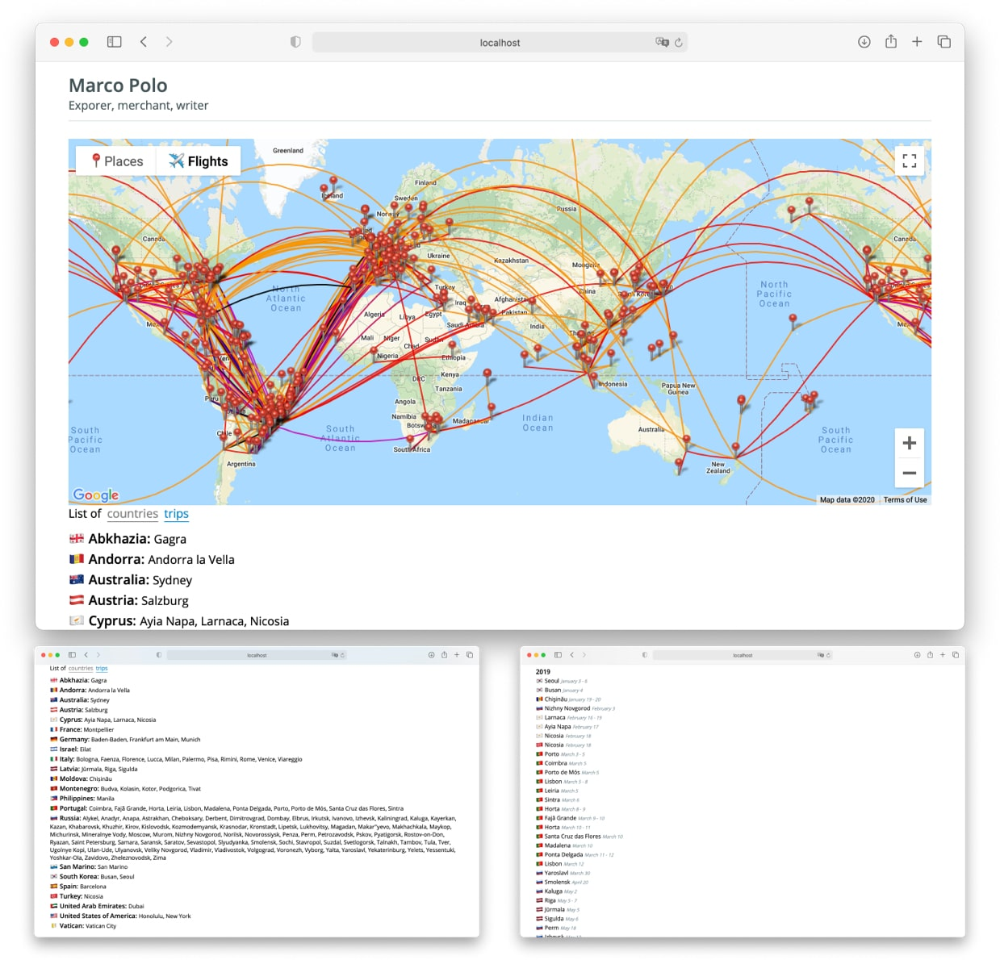
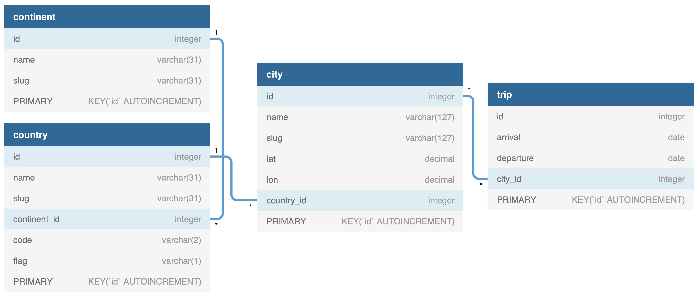

# Travel Journal 🌍✈️ — Preserve Your Travel Memories

[](https://github.com/tsaplev/traveljournal/actions)

> An intuitive app for tracking visited cities, flights, and capturing the essence of your adventures!



## 🌟 Features

- 📍 Plot and view visited cities on a map
- ✈️ Trace and view your flight paths
- 📆 Access an organized list of travels, categorized by countries and years
- 🔄 Seamlessly switch between Cities Map and Flights Map views
- 🛡 Keep all your precious data self-hosted and secure

## 🎥 Demo Mode

Check out the latest version demo [here](https://tsaplev.github.io/TravelJournal).

**Quick Local Try-Out:**

1. Generate a local build:
   ```sh
   yarn build:demo
   ```
2. Launch `dist/index.html` in your browser.

## 🚀 Getting Started

### 1. Fill Database With Your Travel Data

> **NOTE**: _A basic understanding of relational databases is needed._

Utilize your preferred tool to populate the SQLite database [db.sqlite3](./db.sqlite3). The table sequence is: `continent`, `country`, `city`, `trip`.



### 2. Sync with Flightradar Profile

Our app leverages [my.flightradar24.com](https://my.flightradar24.com) for flight data. If you're not on it yet, sign up and complete your profile.

### 3. Personalize Your Configuration

Adjust the [config.js](src/view/config.js) with your details:

| Key                 | Description                                                                                   |
| ------------------- | --------------------------------------------------------------------------------------------- |
| siteTitle           | The title for the browser tab                                                                 |
| title               | Your name                                                                                     |
| googleMapApiKey     | [Google Map API Key](https://developers.google.com/maps/documentation/javascript/get-api-key) |
| flightradarUsername | Your username on [my.flightradar24.com](https://my.flightradar24.com/)                        |

### 4. Set Up the App

- **Install Dependencies**

  ```sh
  yarn install
  ```

- **Build the App**
  ```sh
  yarn build
  ```

### 5. Dive In!

After building, just open the `index.html` inside the `dist` folder.

## 🛠 Technologies Used

- **[JavaScript](https://developer.mozilla.org/en-US/docs/Web/JavaScript)** - Our primary development language.
- **[Node.js](https://nodejs.org/en/)** - For script execution.
- **[SQLite](https://www.sqlite.org/index.html)** - Data storage solution.
- **[Webpack](http://webpack.js.org)** - Frontend code bundling.
- **[Yarn](https://yarnpkg.com)** - Dependency management.
- **[ESLint](https://eslint.org)** - Ensuring consistent code style.
- **[Jest](https://jestjs.io)** - Unit testing.

## 📜 License

Licensed under the [MIT License](./LICENSE).
